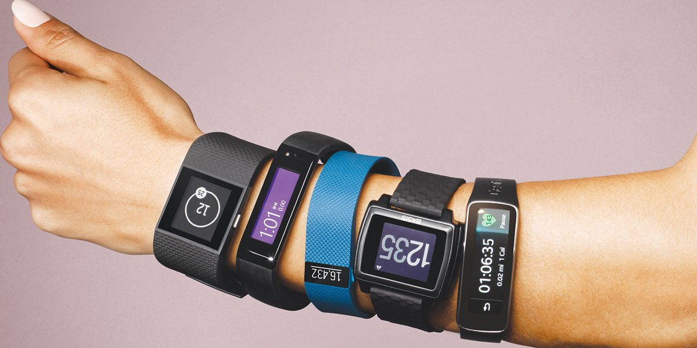
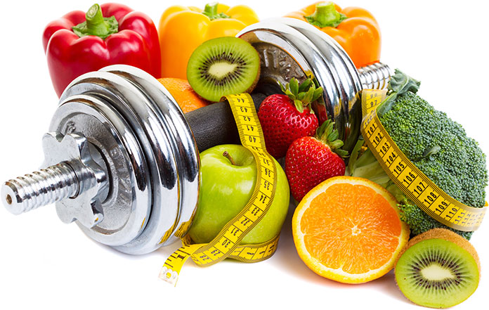
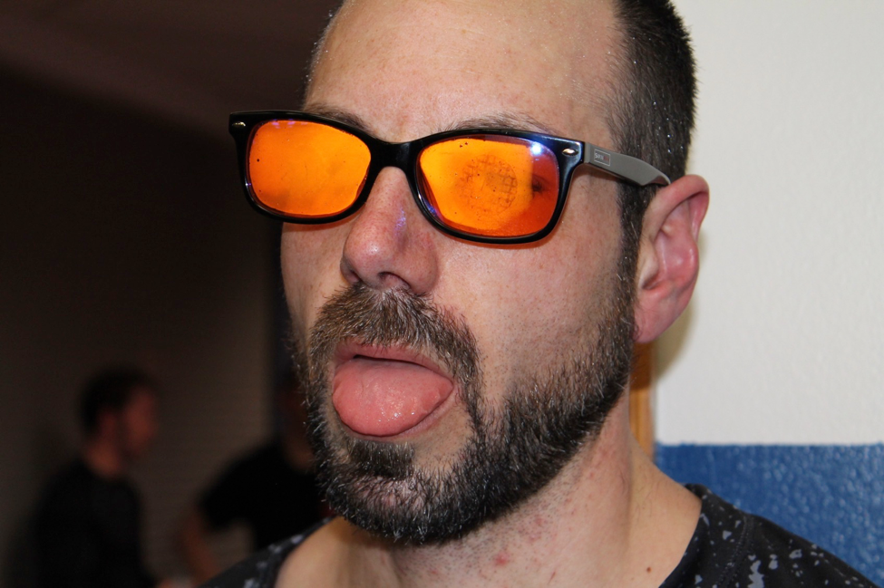
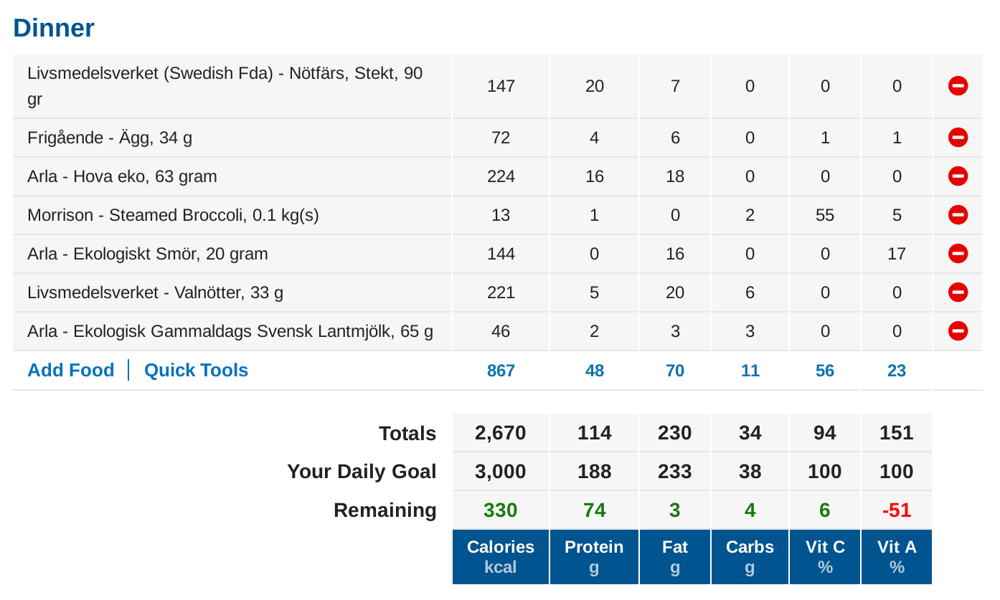
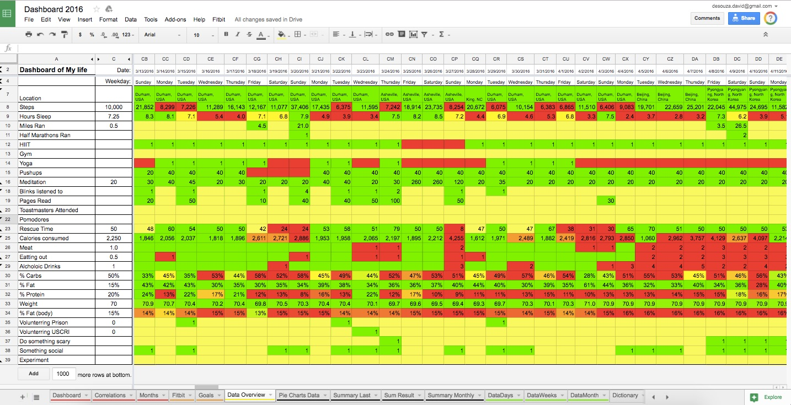

Biohacking & Quantified Self
================================

Note:
whoami
======
[Fredrik Liljegren](https://fredrik.liljegren.org/)
[@fiddur](https://twitter.com/fiddur)
[ Aula Education](https://aula.education/)

What is Bio Hacking?
====================

Note:
Approaching your biology, your health, with a hacker mentality.

Grinders
Body builders

[Hacker](http://catb.org/jargon/html/H/hacker.html)
--------

RFC1392 defines:

> A person who delights in having an intimate understanding of the internal workings of a system…

(Not talking about Grinders)

Quantification
==============

Get the idea
------------

Note:
Anti-aging
Fitness
Health
Kicking ass

Measure
-------

Affect
------

Note:
Blocking blue light a few hours before going to bed.

Reality check
-------------

> ...chasing the "no"...

Measuring and Quantification
============================

525 600 minutes
---------------
How do you measure a year in the life?

> 🎶 In daylights? 🎶  
> In sunsets?  
> In midnights?  
> In cups of coffee?  
> In inches, in miles, in laughter, in strife?  

Note:
Measuring behaviour affects behaviour.

Note:
Bein data driven

> Having to record "4 M&Ms" along with lunch is just kinda annoying.

What have I learned?
====================

Stopping self deception
-----------------------

[Headache pills since 2017]()

<section data-background-iframe="https://slides.com" data-background-interactive>
  <h2>Iframe</h2>
</section>
    
