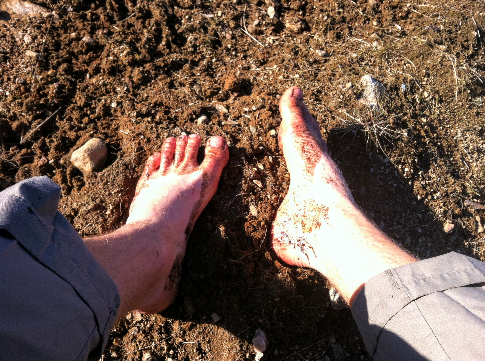

Biohacking & Quantified Self
================================

Note:
* What it is
* How it can be done
* What I do
* Discussion

whoami
======
[Fredrik Liljegren](https://fredrik.liljegren.org/)
[@fiddur](https://twitter.com/fiddur)
[ Aula Education](https://aula.education/)

Bio Hacking
===========

Finding a smarter approach.

Note:
Bio - biology.

Approaching your biology, your health, even relations, with a hacker mentality.

Athletes
Body builders

[RFC1392](https://tools.ietf.org/html/rfc1392) (Internet User's Glossary) defines:

> A person who delights in having an intimate understanding of the internal workings of a system…

[Jargon file](http://catb.org/jargon/html/H/hacker.html) definition #7:

> One who enjoys the intellectual challenge of creatively overcoming or circumventing limitations.

Note:
* Mixup hackers crackers
* Cracking our body's code

### The grinders

### …and lots of different "hacks"

Note:
Blocking blue light a few hours before going to bed.

Note:
Starting a new habit.
* Burning fat, getting energy

Note:
Getting rid of something.
* Running technique

Note:
Adding something.
* Teach body to burn fat
* Consistent energy through the day

Quantified Self
===============

Know thyself (through numbers).

Note:
* Biohackers that don't quantify.
* Quantifiers that don't hack.

525 600 minutes
---------------
How do you measure a year in the life?

> 🎶 In daylights? 🎶  
> In sunsets?  
> In midnights?  
> In cups of coffee?  
> In inches, in miles, in laughter, in strife?  

Note:
* Health
* Productivity
* Aging
* Kicking ass
* Relationships
* Habits
* Fitness, weight

Measuring habits has its own value.

Automated measuring

Note:
* Heart rate
* Sleep
* Movement, steps

Note:
* Something scary - pushing the bounds of your comfort zone

Find correlations
-----------------

Note:
* Rescue time
* Sleep tracker
* Should measure sleep quality!

Note:
Does my walking really affect my weight?
* Bring up dashboard

Note:
* Not tracking the right thing
* No progress
* Too much chaos.

Rinse and repeat
----------------

> ...chasing the "no"...

* Study
* [Discuss](https://forum.quantifiedself.com/)
* Get a new or modified approach

Note:
* Other correlations?
* Things to track

Get inspiration
---------------

* Podcasts
  * Bulletproof / Dave Asprey
  * Mind Valley
* Blogs

Note:
Pseudo-science, try it yourself!
* Snake oil, FREE snake oil!
* Morning habits
* Dietary and exercise changes
* Switching light bulbs

What I'm doing
==============

Note:
* Early on:
  * Weight
  * Meditations per day
* Very few clear answers.
* Lots of insights about myself.
  * Addicions, food changes, my mind tricks me.
  * When fasting, actually easier.
  * Not as healthy as I tell myself.
* Techniques and habits.
  * Coffee with butter and coconut oil.
* Recently:
  * Trackers: Heart rate, steps, runs/activities
  * Logging: Waist, Head ache
  * Occasionally: Food, body temp, supplements

Note:
* Losing weight before wedding
* Feeling good, not looking good
* Disillusioned health, head aches!

Note:
* Noticed high heart rate
* 9:07 - ibuprofen
* 13 - full effect
* HR going up before temp

Carbohydrate Intolerance
------------------------

Problem: Head aches.

Theory: My head ache is affected by sugar/insuline fluctuations.

Experiment: [2 week low carb](https://philmaffetone.com/2-week-test/), what happens on carb re-introduction?

Note:
Inspired by Maffetone two week test.  After two weeks, evaluate:
* Sleep
* Energy
* Waist
* Head aches...

Note:
* Logging food, changes what you eat.

> "Having to record "4 M&Ms" along with lunch is just kinda annoying.

Low heart rate running
----------------------

Nov 2018 - Feb 2019

Goal: Get more consistent running without adverse health effects.

Theory: [Phil Maffetone](https://philmaffetone.com) - Increasing aerobic function, reducing physical stress.

Experiment: Run with a max heart rate of 133, 3-5 times a week.

Note:
* HR calculation
* Göteborgsvarvet

Note:
* Snow
* No colds
* More energy after running

Dashboard
---------

Jan 2019 -

* Better automated logging.
  * RescueTime
* Better manual logging.
  * Wear OS app…
* Transferring data
  * Old logging -> Google Fit
  * Data mining

Note:
Show dashboards.
* Long term HR
* Transferring my steps

Coming soon…
------------

* Resistent starch (feeding my gut bacteria)
* Productivity logging/correlations
* What affects my focus?
* Triggering Flow

Note:
* Using rescueTime metrics
* Rise of Superman

The key is progression, not perfection.
(First heard from Charles Poliquin, used more widely.)

Biohacking is not about trying harder, it's about finding a better approach.
