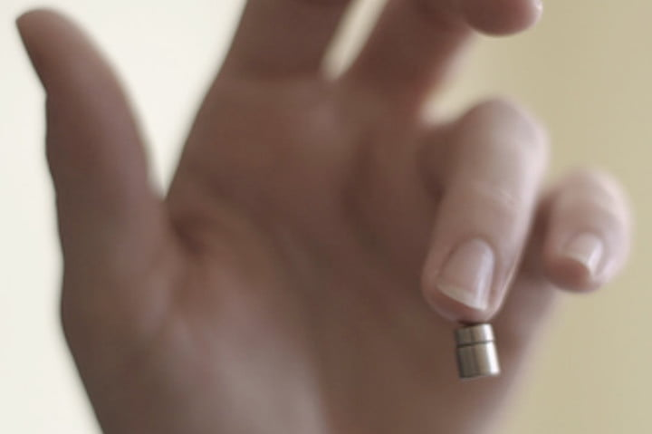
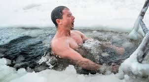
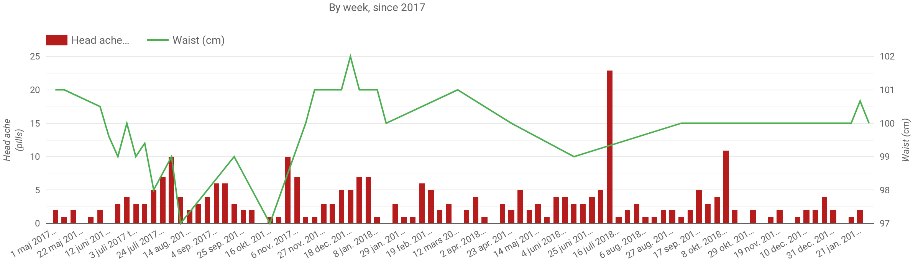

Biohacking & Quantified Self
================================

Note:
* What it is
* How it's done in general
* Good examples
* Personal examples
* How to get started

whoami
======
[Fredrik Liljegren](https://fredrik.liljegren.org/)
[@fiddur](https://twitter.com/fiddur)
[ Aula Education](https://aula.education/)

What is Bio Hacking?
====================

Note:
Rich Hickey - pick word, talk definition.

Bio - biology.

Approaching your biology, your health, even relations, with a hacker mentality.

Athletes
Body builders

[RFC1392](https://tools.ietf.org/html/rfc1392) defines:

> A person who delights in having an intimate understanding of the internal workings of a system…

[Jargon file](http://catb.org/jargon/html/H/hacker.html) definition #7:

> One who enjoys the intellectual challenge of creatively overcoming or circumventing limitations.

Note:
In practice…

### The quantifiers

### The grinders

### …and lots of different "hacks"

Note:
Blocking blue light a few hours before going to bed.

How it's done
=============

Measure something of value
--------------------------

Note:
* Fitness, weight
* Health
* Productivity
* Aging
* Kicking ass
* Relationships
* Habits

Measuring habits has its own value.

Find correlations
-----------------

Hack it!
--------

What have others done?

Note:
* Building/modifying habits
* Getting rid off… (carbs, shoes)
* Adding… (polyfenols, supplements, minimalistic shoes)
* Stopping…

Note:
Starting a new habit.

Note:
Getting rid of something.

Note:
Adding something.

Evaluate / Reality Check
------------------------

Do I really have less head aches now?

Rinse and repeat
----------------

> ...chasing the "no"...

* Study
* [Discuss](https://forum.quantifiedself.com/)
* Get a new or modified approach

Personal stories
================

Note:
* Early on:
  * Weight
  * Meditations per day
* Recently:
  * Trackers: Heart rate, steps, runs/activities
  * Logging: Waist, Head ache
  * Occasionally: Food, body temp, supplements

Stopping self deception
-----------------------

[Headache pills since 2017]()

Get started
===========

Note:
or rather, go further

525 600 minutes
---------------
How do you measure a year in the life?

> 🎶 In daylights? 🎶  
> In sunsets?  
> In midnights?  
> In cups of coffee?  
> In inches, in miles, in laughter, in strife?  

Note:
Measuring behaviour affects behaviour.

Note:
Bein data driven

> Having to record "4 M&Ms" along with lunch is just kinda annoying.

> The key is progression, not perfection.

Note:
First heard from Charles Poliquin, used more widely.
