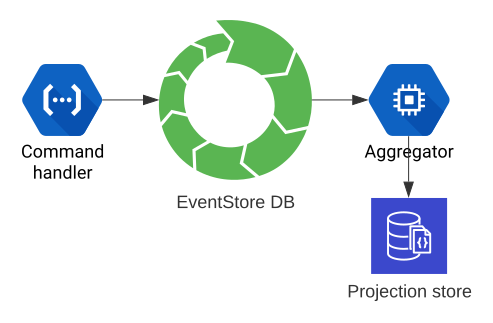
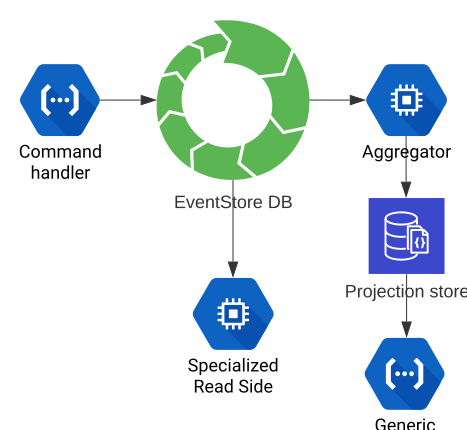

Event Sourcing and CQRS in a Microservices/Serverless architecture

Fredrik Liljegren, VOYD, 2022

Note:
* - 3:00
* 2009 Textalk
* Copying files, no history, no rollback
* Vanished code, failing code panic
* Git - change, who, when, purpose


```bash
commit 1999fb5fc37bd5265c84f8f5e95d01012987786b
Author: Fredrik Liljegren <fredrik@liljegren.org>
Date:   Tue Sep 22 10:36:48 2020 +0200

    Updating The File

diff --git a/theFile.md b/theFile.md
index 040f798..2040db2 100644
--- a/theFile.md
+++ b/theFileWithANewFilename.md
@@ -76,7 +76,6 @@ Note:
 An untouched line for context
-Some line to remove 😲
+Added a line 😏
```

Note:
* - 4:00
* Aggregate current state
* Annotate


```bash
3dc71318 (Fredrik 2019-03-31 09:59:12 +0200  55) Event characteristics
3dc71318 (Fredrik 2019-03-31 09:59:12 +0200  56) ---------------------
3dc71318 (Fredrik 2019-03-31 09:59:12 +0200  57) 
7c23a00d (Fredrik 2019-04-02 09:58:58 +0100  58) * Semantic
7c23a00d (Fredrik 2019-04-02 09:58:58 +0100  59) * Atomic
```

Note:
* - 5:00
* DST 2 lines
* Surprised if anyone updates the current state, losing all history
* Still see state changing in backend!
* UPDATE row -> loose data


```yaml
   stream: Comment-abc123

eventType: Commented
 revision: 0
       at: 2022-03-10T09:58:50.123Z
       by: user-sdf234
       on: Product-ghj567
     body: This is my comment body.

eventType: EditedComment
 revision: 1
       at: 2022-03-10T10:58:50.987Z
       by: user-sdf234
     body: THIS is MY comment body!!!
```




Note:
* ..:00
* Projection optional




Note:
* ..:00
* Segregate Command handler from Query responsibilities


CQRS
====
Command/Query Responsibility Segregation


> As long as you UPDATE your main source of truth, you are loosing valuable data.

Fredrik Liljegren / @fiddur
