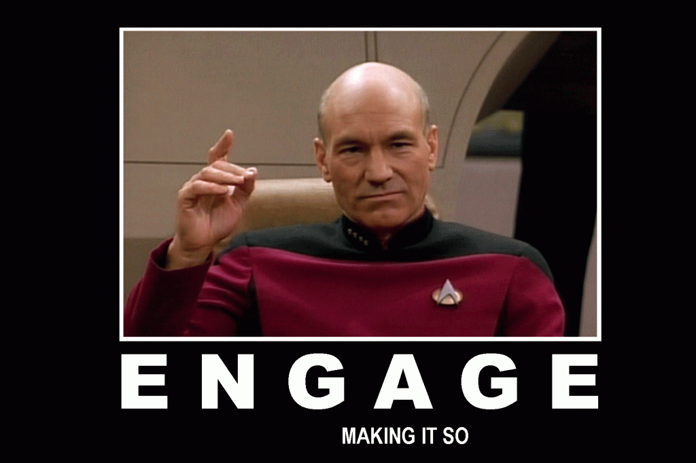
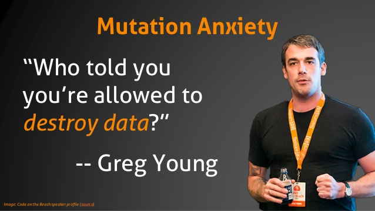

Event Architectures
===================

> There has been a revolution; organizations must become real time; to become
> real time, they must become event driven.

– Neil Avery


Some terminology
----------------


Commands



Note:
E.g. HTTP POST


Queries


Note:
Request/response


Events, two versions...


Directed events


Note:
SQS  
Almost commands...


First class events


Note:
First class thingimagiggies (Martin Fowler)  
Can be inside a service or browser, but for a distributed system, we need distributed events.  
SNS, publish/subscribe  
Past tense.


Event characteristics
---------------------

* Semantic
* Atomic
* Related
* (Behavioral)
* (Projectable)


### Thin events notification

```yaml
type: conversation:MessageAdded
data:
  conversation: 1a2s3d4f
  message: 2s3d4f5g
```

Note:
Client fetches updates from API.


### Fat events notification

```yaml
type: conversation:MessageAdded
audience:
  users:
    - 2s3d4f5g
    - 3d4f5g6h
data:
  content: {"blocks": ...}
  conversation: 1a2s3d4f
  message: 8f7d6s5a
  writer: 3d4f5g6h
```

Note:
Authorization handling on event broker.  
Martin Fowler version: Event-Carried State Transfer


### Event sourcing

* Switching source of truth.
* Necessary for FIRST class events.
* Immutable data store.
* reducer
* projection
* saga


Forcing event first thinking
----------------------------

> Event-first thinking changes how you think about what you are building


Not destroying data
-------------------




Audit logging
-------------

When the event is required to store anything, no change will be unlogged.


Optimistic concurrency
----------------------

Avoiding race conditions both in frontend and command handlers:

1. When fetching data, you get version number.
2. Do something.
3. Send change command for that version.

Note:
Frontend uses ETag as version number (If-None-Match If-Match)  
We can do this without event sourcing, by adding a version in the data storage
and validate that.  But we don't.  And, we won't.


DDD
===

Domain Driven Design


(Micro)services
===============

* SOA done right
* Finding the right boundaries (DDD)


Back to practicality reality
============================

Note:
* How it can positively affect the developer experience?
* How to maintain, test, monitor those services?
* Where is the limit? We don’t have a huge team to maintain dozens of services so maybe we need to apply some boundaries when splitting services.
* Why do we need it? Examples of things that we struggle with that could be solved by such things.
* Data. Like proof that such system will reduce load/help with scale and reliability.


Notifications
-------------

One or many?  Storage boundary.

* Web pusher
* Mobile pusher
* Mailer
* Pull ...


System Touches Note Activity
----------------------------


