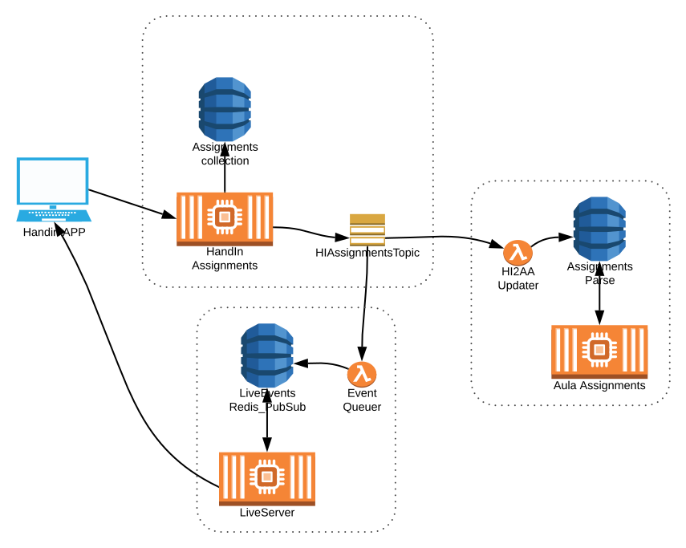

Event Architectures
===================

> There has been a revolution; organizations must become real time; to become
> real time, they must become event driven.

– Neil Avery


Some terminology
----------------


Commands


Note:
E.g. HTTP POST


Queries


Note:
Request/response


Events, two versions...


Directed events


Note:
SQS  
Almost commands...


First class events


Note:
First class thingimagiggies (Martin Fowler)  
Can be inside a service or browser, but for a distributed system, we need distributed events.  
SNS, publish/subscribe  
Past tense.


Event characteristics
---------------------

* Atomic: something happened (a student made a submission).
* Related: a stream or sequence of events (all submissions belong to an HI assignment, HI assignments belong in HandIn).
* Behavioral: accumulated events describe system usage.
* Projectable: the result of all events equals current state.


### Thin events notification

```yaml
type: conversation:MessageAdded
data:
  conversation: 1a2s3d4f
  message: 2s3d4f5g
```

Note:
Client fetches updates from API.


### Fat events notification

```yaml
type: conversation:MessageAdded
audience:
  users:
    - 2s3d4f5g
    - 3d4f5g6h
data:
  content: {"blocks": ...}
  conversation: 1a2s3d4f
  message: 8f7d6s5a
  writer: 3d4f5g6h
```

Note:
Authorization handling on event broker.  
Martin Fowler version: Event-Carried State Transfer




Note:
Before going into details about live-server, we'll look at more events!


### Event sourcing

Note:
Switching source of truth.  
Necessary for FIRST class events.  
Immutable data store.

Previously
----------

1. Check authorization.
2. Validate toward current data.
3. Change data. (Open for race condition changes)
4. Log.
5. Emit event.

Note:
Changing data is open for race condition.  
All updates destroy data!


Roughly current code
```js
const { assignment } = await findAssignmentById...

verifyRole({ roles, spaceId: assignment.space })

const result = await updateAssignment({ ... })

logger.debug(' => create assignment: \n ', assignment);

pushEvent({ type: 'assignment:Updated' })

return { status: 200 }
```


With event sourcing
```js
const { assignment } = await findAssignmentById...

verifyRole({ roles, spaceId: assignment.space })

addEvent({ expectedVersion: assignment.version, type... })

return { status: 200 }
```

Note:
version based on event number


Read side / aggregator

```js
const reducers = {
  Created: ({ data }) => data,
  AssignedToSpace: ({ data: { space }, store }) =>
    ({ ...store, space }),
};

const events = await getEvents({
  aggregate, from, to, types: Object.keys(reducers),
})
const projection = events.reduce(apply(reducers))
```

Note:
* reducer  
* projection  
* saga  


Forcing event first thinking
----------------------------

> Event-first thinking changes how you think about what you are building


Audit logging
-------------

When the event is required to store anything, no change will be unlogged.


Optimistic concurrency
----------------------

Avoiding race conditions both in frontend and command handlers:

1. When fetching data, you get version number.
2. Do something.
3. Send change command for that version.

Note:
Frontend uses ETag as version number (If-None-Match If-Match)  
We can do this without event sourcing, by adding a version in the data storage
and validate that.  But we don't.  And, we won't.


Change management
-----------------

Ever wanted to rename a misspelt property?

Make a `GET /assignments/:id` v2:

```js
AssignedToClassroom: ({ event, state }) => ({
  ...state
  space: event.classRoom,
})
```

Note:
Old events are forever...  
We could do this anyway.  For bigger things, double write, migration, take down
old.  Or, migration and change-events from db.  But we don't.  And we won't.


Version history
---------------

Just aggregate SOME events, and you have an older version.

Note:
We could do this anyway.  We have SOME version history in material, but not all.  So, we don't.  And we won't.


CQRS
====

Command  
Query  
Responsibility  
Segregation  


Back to practicality reality
============================


Live-server
-----------


### Event pushing

See [live-client](https://github.com/AulaEducation/aula/tree/liveEventsLambda/shared/live-client)


### Event structure

```javascript
pushEvent({
  audience: {
    educators: [assignment.space],
    students: assignment.isHidden ? [] : [assignment.space],
  },
  correlationId,
  data: assignment,
  stream: `handin-assignment-${insertedId}`,
  timestamp: assignment.createdAt,
  type: 'assignment:Created',
});
```


### Event receiver

See [live-server sam](https://github.com/AulaEducation/aula/tree/liveEventsLambda/sam/live-server)


### live-server next steps

* Accepting connections with accessToken (for educator/student audience).
* Connecting to live-server with accessToken from web-app.
* Upgrading services to send `v2` events.
* Clean away all event-specific logic from live-server!
